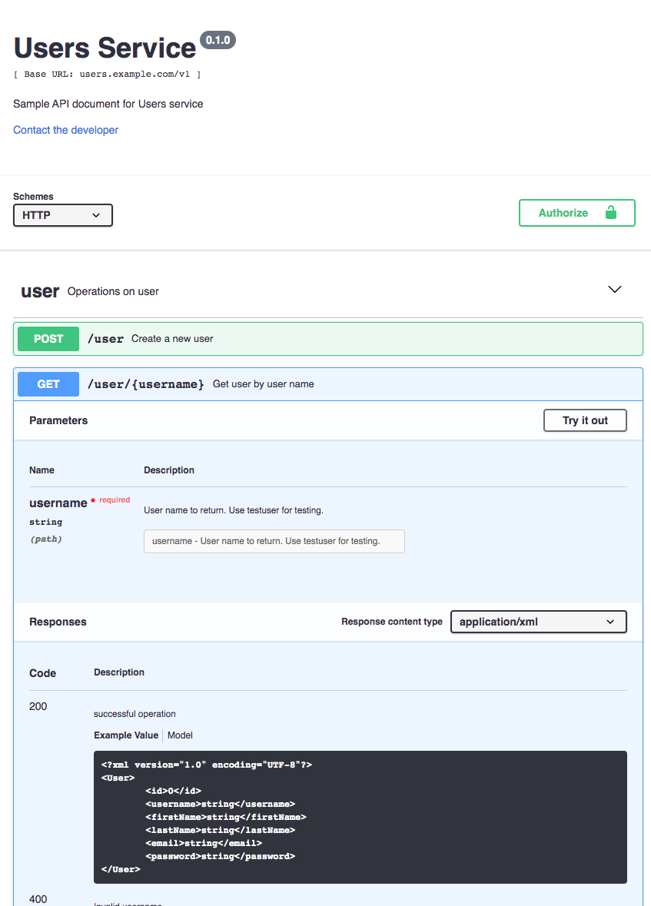

# API Exercises

In this exercise you will be using [Swagger](http://editor.swagger.io/) to create an API document, generate a service implementation.


## Create the API spec

You can use an online API editor at http://editor.swagger.io to create/test the API.

1. Go to the http://editor.swagger.io
1. Copy/paste the contents of the provided `users.yaml` file. You can also create your own API spec or modify the users one if you want to.

On the right side of the editor, you will see the UI representation of your API. You can explore operations and models the API has as shown in figure below.



## Create server code

First order of business is to generate code for our service - the server code. 

1. From the http://editor.swagger.io, click the **Generate Server** menu and pick your language (I am using Javascript (`nodejs-server`) for the example).

1. As you pick the language, Swagger generates the server code and you can download the server package. 

1. Unzip the package into a desired folder.

At this point, let's run `npm start` from the folder to launch the server.

```
$ npm start
...
> users-service@0.1.0 start  /nodejs-server-server 
> node index.js

Your server is listening on port 8080 (http://localhost:8080)
Swagger-ui is available on http://localhost:8080/docs

```

With the server running, you can open a second terminal window and try to invoke some of the API endpoints.

```
$ curl http://localhost:8080/v1/user/someuser
{
  "firstName": "firstName",
  "lastName": "lastName",
  "password": "password",
  "id": 0,
  "email": "email",
  "username": "username"
}
```

If you look at the source code (`/service/UserService.js`) you will notice that a same user is being returned each time.

The idea behind the generated server code is to get you quickly up and running with a service. The next step would be to go an implement the actual business logic. 

For the sake of simplicity, let's implement a simple in-memory storage for the users service.

## Implement server code

First, let's define an array where we will store the user information. We will make all updates in the `/service/UserService.js` file in your generate server project you downloaded earlier.

1. Define the array - add the following line to the top of the file:

```
'use string'

let users = [];
```

1. Implement `createUser` function:

```
exports.createUser = function (body) {
  return new Promise(function (resolve, reject) {
    users.push(body)
    resolve();
  });
}
```

1. Implement `deleteUser` function:
```
exports.deleteUser = function (username) {
  return new Promise(function (resolve, reject) {
    for (var id in users) {
      const u = users[id];
      if (u['username'] === username) {
        users.splice(u, 1)
        resolve();
        return;
      }
    }
    resolve();
  });
}
```

1. Implement `getUserByName` function:

```
exports.getUserByName = function (username) {
  return new Promise(function (resolve, reject) {
    for (var id in users) {
      const u = users[id];
      if (u['username'] === username) {
        resolve(u);
        return;
      }
    }
    resolve();
  });
}
```

1. Implement `updateUser` function:

```
exports.updateUser = function (username, body) {
  return new Promise(function (resolve, reject) {
    for (var id in users) {
      const u = users[id];
      if (u['username'] === username) {
        users[id] = body;
        resolve();
        return;
      }
    }
    resolve();
  });
}
```

## Testing the server code

Next, run the `npm start` from the project folder to start the service and you can then test the service.


1. Create a new user:

```
$ curl -X POST "http://localhost:8080/v1/user" -H "accept: application/json" -H "Content-Type: application/json" -d "{ \"id\": 0, \"username\": \"johnd\", \"firstName\": \"John\", \"lastName\": \"Doe\", \"email\": \"john@learncloudnative.com\", \"password\": \"hello\"}"
```

1. Retrieve the user:

```
$ curl http://localhost:8080/v1/user/johnd
{
  "id": 0,
  "username": "johnd",
  "firstName": "John",
  "lastName": "Doe",
  "email": "john@learncloudnative.com",
  "password": "hello"
}
```

1. Update the user (change the username from `johnd` to `john_doe`):

```
$ curl -X PUT "http://localhost:8080/v1/user/johnd" -H "accept: application/json" -H "Content-Type: application/json" -d "{ \"id\": 0, \"username\": \"john_doe\", \"firstName\": \"John\", \"lastName\": \"Doe\", \"email\": \"john@learncloudnative.com\", \"password\": \"hello\"}"
```

1. Retrieve the user by the new username (`john_doe`):

```
$ curl http://localhost:8080/v1/user/john_doe
{
  "id": 0,
  "username": "john_doe",
  "firstName": "John",
  "lastName": "Doe",
  "email": "john@learncloudnative.com",
  "password": "hello"
}
```

1. Delete the user:

```
$ curl -X DELETE http://localhost:8080/v1/user/john_doe
```

At this point the user should be deleted - you can try retrieving it again and see that nothing gets returned. Similarly, you can try and add more users as well.
